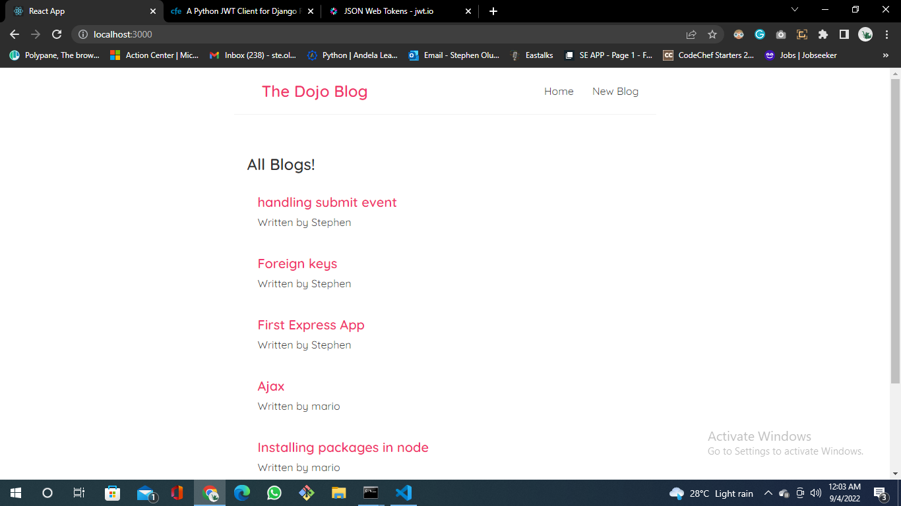
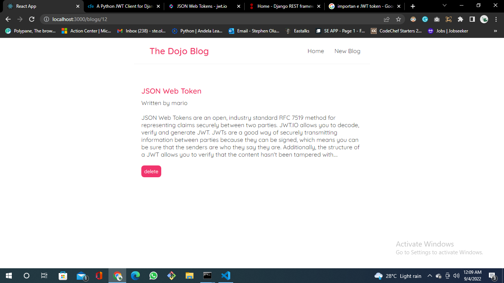
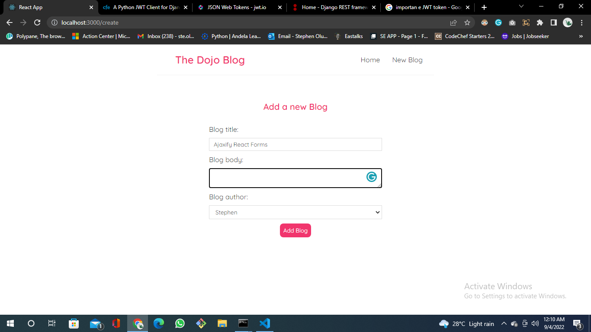

# react-dojo-blog
react-dojo-blog is a blog application coded in React. The database used is json-server. This application is used for normal blogging purposes and has the following features:-

* Create a blog post
* View a blog post
* Delete a blog post

The application is made for bloggers.

## Screenshots

 

 

 

## How to install and run this project
1. clone the repo
2. run `npm install`
3. run `npm start` to start the development server
4. run `npx json-server --watch --port 8000`

